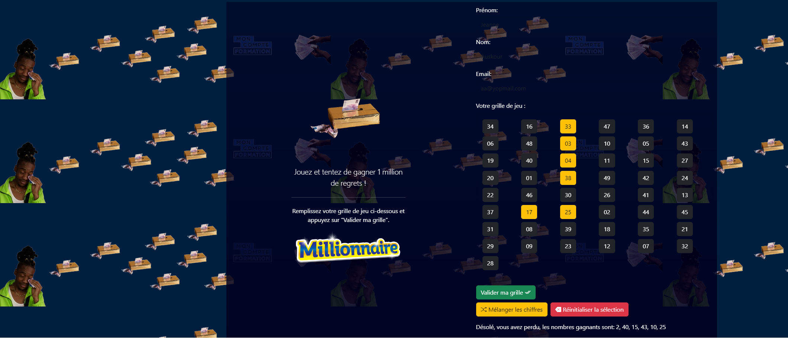

# Millionnaire Lotto GTPowered

## What Was Done

- Enhanced the Lotto web application with a dark blue background and an animated background effect.
- Created a dynamic number grid from 1 to 49 with clickable buttons for user selection.
- Implemented a shuffle button to randomize the number grid.
- Validated user input for the first name, last name, and email.
- Checked if the user selected exactly 6 numbers and provided winning/losing feedback.
- Added GIFs for winning and losing scenarios.
- Styled the form input text with a yellow color.

## Who We Are

We are a team dedicated to creating engaging web applications. Our goal is to bring excitement and entertainment to users through innovative and interactive experiences.

## Powered By

